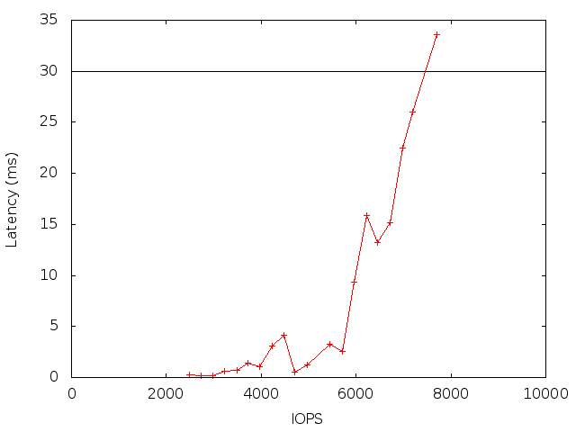

# Pblio Sample run

These are the results of running pblio without pblcache on an OpenStack virtual machine backed by Cinder block storage.
The virtual machine was setup with three volumes of 10GB for ASU1, three 10GB volumes ASU2, and three 3GB volumes for ASU3. 
Pblio was run for eight hours to set the storage system into a steady state.  Once the storage system was warmed, pblio was run with
Business Scaling Unites, or BSU, of 50 to 300 for ten minutes each with each BSU requiring 50 IOPS.  The pblio test fails
once the average latency is greater than 30ms.

As shown by the figure, the system was able to handle a maximum of 155 BSUs or 7750 IOPS before failing the latency
requirement.

More detailed diagrams for each BSU run are available in the [data](data) directory.

